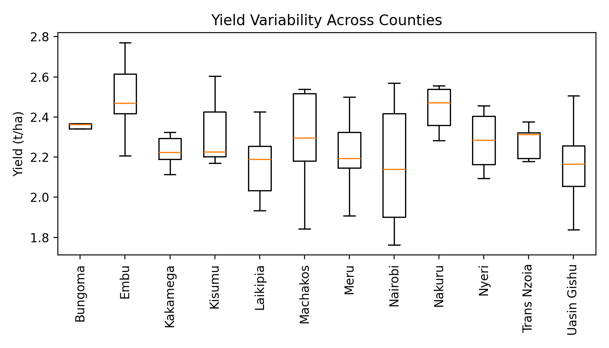
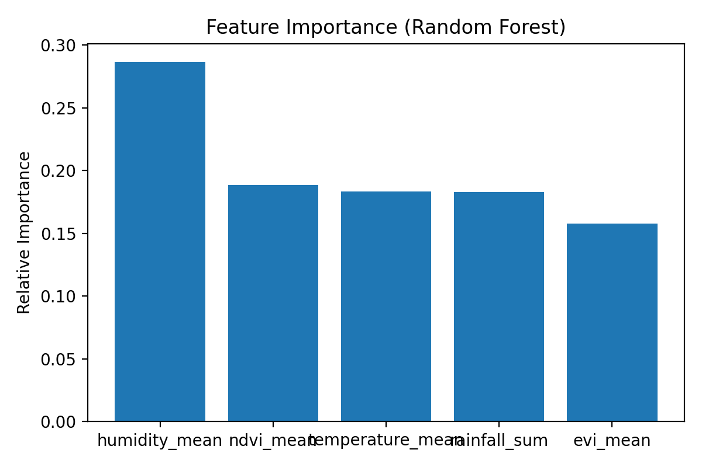
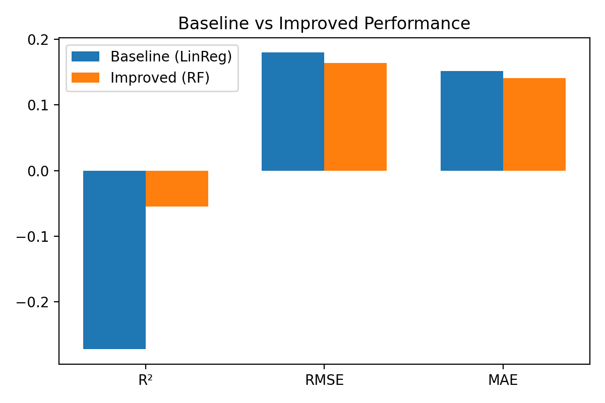
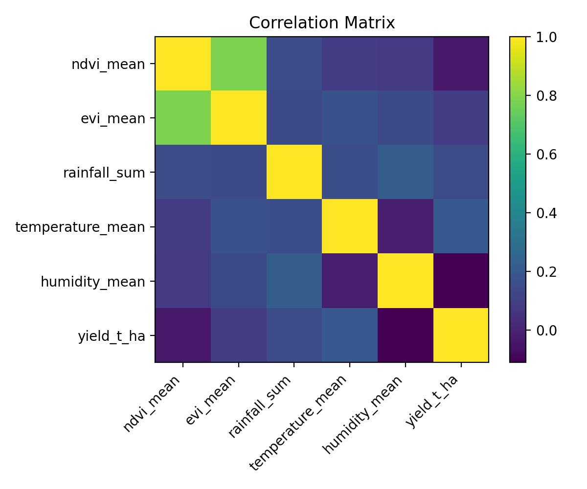
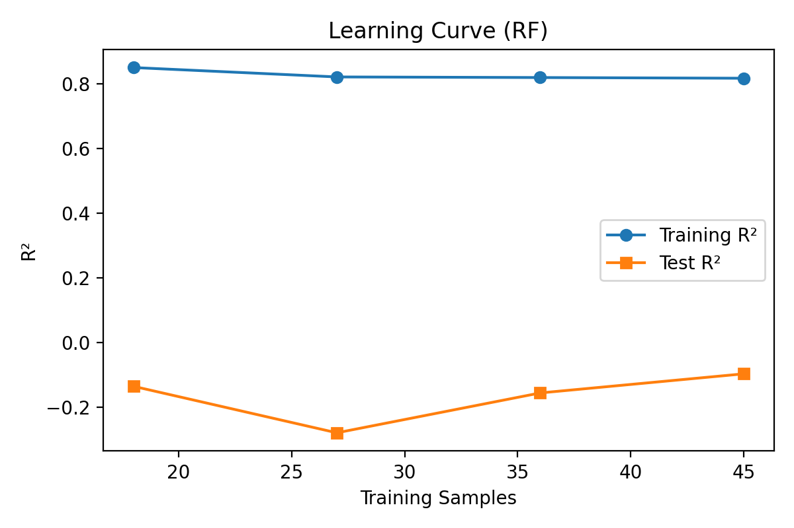

# DSA4900-MaizeYield-Prediction
Predicting maize yield using satellite and environmental data).
# 📈 Model Performance and Visual Insights

The following visualizations summarize the performance and interpretability of the maize yield prediction models.  
They highlight key relationships between environmental factors, vegetation indices (NDVI/EVI), and maize yield outcomes across Kenyan counties.  
These visuals provide evidence of model improvement, data distribution patterns, and the dominant predictors driving yield variability.

# 📊 Results

Below are the main visual outputs from the maize yield prediction analysis:

### Yield Variability

### Feature Importance (Random Forest)

### Baseline vs Improved Performance

### Correlation Matrix

### Learning Curve (Random Forest)

